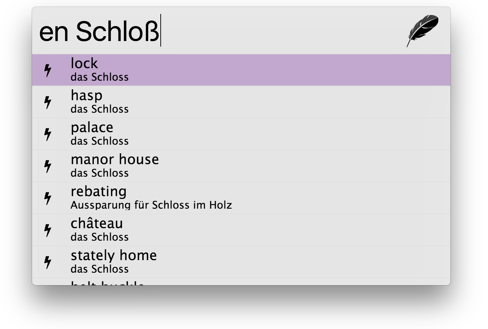
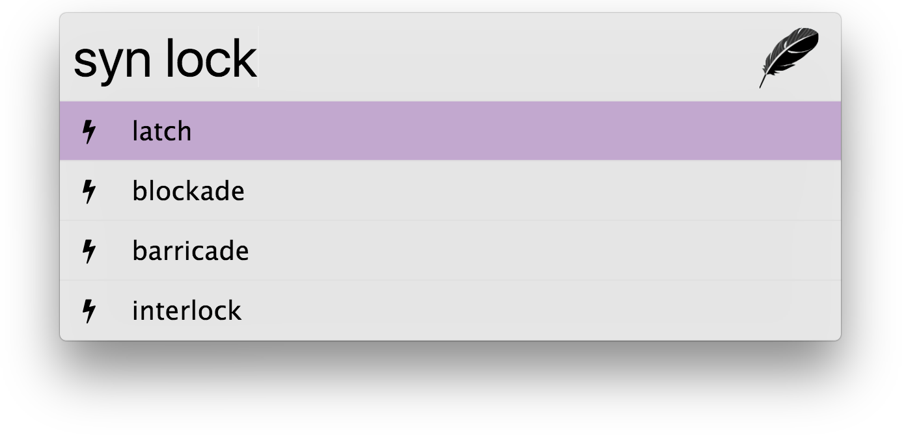

# Zazu dictionary

> for synonyms and translation of german <-> english (and others).

## Usage

Start a query with any supported language (`ch`, `en`, `es`, `fr`, `it`, `pl`, `pt`, `ru`). i.e.

- `en Schloss` will show possible translations from german to english,
- `en lock` will show possible translations from english to german

In case of missing search results, either similar valid words or no items will be printed. To search for synonyms try

- `syn lock`, which will show synonyms in the given language (defined by the query)


## Screenshots

### translate


### synonyms



## Installation

Add `"sagold/zazu-dict"` to your `~/.zazurc.json` plugins, like:

```json
{
    "plugins": [
        "sagold/zazu-dict"
    ]
}
```

## Disclaimer

It currently offers a cli-interface, zazu plugin and request library. For any details check the source in [./lib/dict](./lib/dict). 
This is an inofficial API to [leo.org](http://www.leo.org). Thus any functionality can not be guaranteed.


